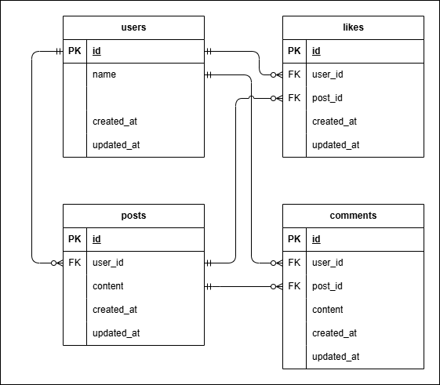

# Twitter風SNSアプリ

## 環境構築
1. クローン
```bash
git clone git@github.com:revoLeminA/twitter.git
```

### Laravel環境構築
1. twitter-backendディレクトリに移動
2. ビルド
```bash
docker-compose up -d --build
```
＊ MySQLは、OSによって起動しない場合があるのでそれぞれのPCに合わせてdocker-compose.ymlファイルを編集してください。
3. コンテナ内にログイン
```bash
docker-compose exec php bash
```
4. 必要なパッケージをインストール
```bash
composer install
```
5. .env.exampleファイルをコピーして.envを作成し、環境変数を構築
```bash
// 前略

DB_CONNECTION=mysql
DB_HOST=mysql
DB_PORT=3306
DB_DATABASE=laravel_db
DB_USERNAME=laravel_user
DB_PASSWORD=laravel_pass

// 後略
```
6. マイグレーションを実行
```bash
php artisan migrate
```
7. php artisan migrate
```bash
php artisan key:generate
```

### Nuxt環境構築
1. twitter-frontendディレクトリに移動
2. モジュールをインストール
```bash
npm install --save nuxt firebase
```
3. .envを作成して以下を記述する
```bash
NUXT_PUBLIC_FIREBASE_API_KEY={firebaseのAPIキー}
NUXT_PUBLIC_FIREBASE_AUTH_DOMAIN={firebaseの認証ドメイン}
NUXT_PUBLIC_FIREBASE_PROJECT_ID={firebaseのプロジェクトID}
NUXT_PUBLIC_FIREBASE_STORAGE_BUCKET={firebaseのバケット}
NUXT_PUBLIC_FIREBASE_MESSAGING_SENDER_ID={firebaseの送信ID}
NUXT_PUBLIC_FIREBASE_APP_ID={firebaseのアプリD}
```
4. 開発サーバーを起動
```bash
npm run dev
```

## 使用技術
- PHP 8.2.0
- Laravel 8.75
- MySQL 8.0.26

## ER図


## URL
- 開発環境：http://localhost:3000/
- phpMyAdmin：http://localhost:8080/


